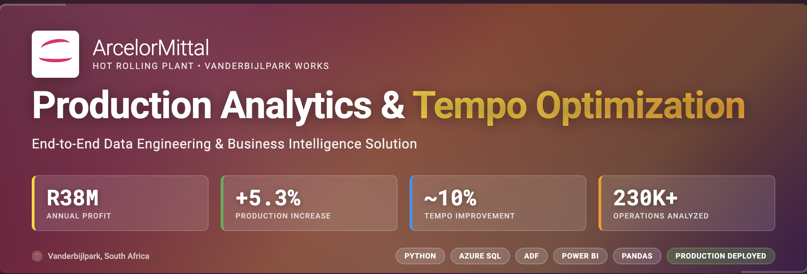
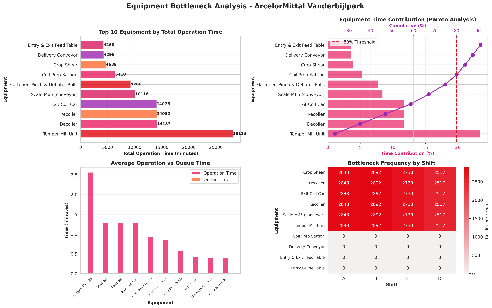
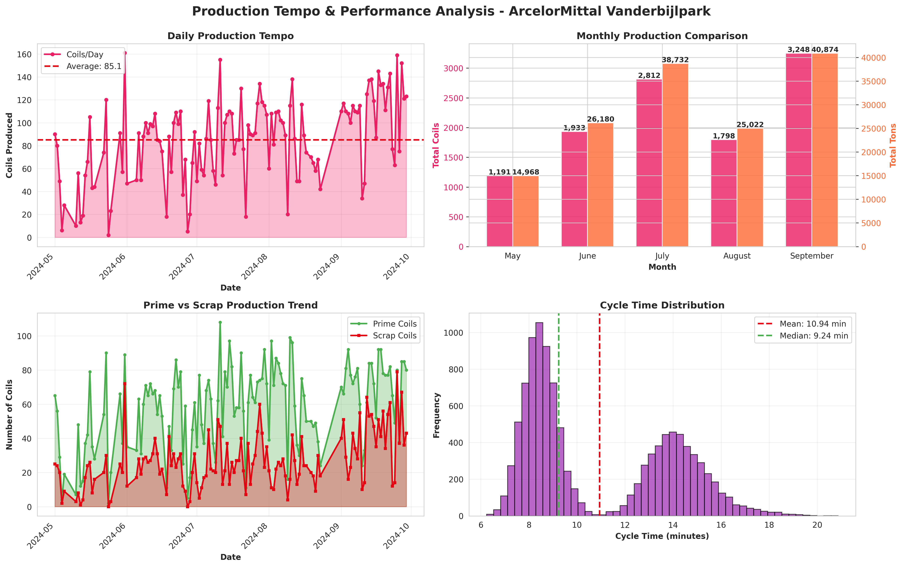

# ArcelorMittal Hot Rolling Plant Production Analytics
## End-to-End Data Engineering & BI Solution

<div align="center">


**Delivered R38M Annual Operating Profit Through Data-Driven Production Optimization**

</div>

---

## Executive Summary

**Business Problem**: After ArcelorMittal Saldanha Works closure redirected thin flat products to Vanderbijlpark, the temper line faced a 30% production increase on equipment not designed for this product mix. The plant missed monthly targets for the first time, with falling tempo, frequent breakdowns, and no visibility into which equipment constrained the line.

**Solution**: I built an end-to-end Azure data pipeline transforming raw MES and maintenance data into executive intelligence dashboards. **The innovation**: synthetic cycle time modeling—reverse-engineering equipment operations from sparse MES timestamps when encoder data was restricted—enabling the plant's first data-driven bottleneck analysis.

**Impact**: Increased monthly production from **38kt to 40kt (5.3% improvement) generating R38M annual operating profit**. Identified 3 critical bottlenecks consuming 44% of line time, achieved ~10% tempo improvement, reduced maintenance downtime 5%, and enabled 4-shift → 3-shift recommendation saving 15+ minutes per handover. The Power BI dashboards became the **primary weekly performance tool** for 15+ daily users across production, maintenance, and executive teams.


*End-to-end pipeline: Python ETL → Azure Data Factory → Azure SQL Database → Power BI dashboards serving plant operations*

---

## Key Achievements

- **R38M Annual Operating Profit**: 5.3% production increase (38kt → 40kt/month) at 95% margin generates R3.2M/month incremental profit
- **~10% Tempo Improvement**: Identified 3 critical bottlenecks (Temper Mill, Exit Coil Car, Decoiler) through equipment-level cycle time analysis
- **Novel Synthetic Modeling**: Engineered equipment operation timelines from sparse MES data—validated <1 second accuracy despite encoder restrictions
- **87.2% Prime Rate**: Exceeded 85% quality target through product mix optimization insights
- **5% Maintenance Downtime Reduction**: MTBF/MTTR analytics enabled targeted interventions on problem equipment
- **40% Manual Reporting Reduction**: Automated dashboards replaced weekly Excel consolidation for management
- **15+ Minute Shift Handover Savings**: Data-driven 4-shift → 3-shift operational recommendation
- **Azure Production Deployment**: Scalable cloud pipeline handling 230,775 equipment operations with hourly refresh

---

## Problem Statement

### **The Business Challenge**

Following Saldanha Works closure, **thin flat steel products redirected to Vanderbijlpark increased temper line targets by 30%** (29kt → 38kt monthly). The final processing step before customer dispatch faced critical constraints:

- Equipment not designed for thin products (originally optimized for thicker gauge)
- No historical performance data for new product mix
- Falling tempo and missed monthly targets for first time ever
- Zero visibility into which of 17 equipment pieces constrained the line
- 25% tempo variance between shifts with no root cause identified
- Reactive maintenance (breakdowns addressed after failure, not predicted)

**Management Question**: *"We're missing targets. What's slowing the line and how do we consistently hit 38kt?"*

### **The Data Gap**

- Level-1 PLC encoder data restricted by IT security (NDA constraints)
- MES system provided only final coil completion timestamps (no equipment-level tracking)
- Maintenance logs in unstructured Excel (manual, inconsistent formatting)
- Operator feedback anecdotal, not data-driven

**Solution Required**: Build equipment operation timeline from sparse data to enable bottleneck analysis.

---

## Technical Solution

### **Architecture Overview**

```
┌─────────────────────────────────────────────────┐
│  DATA SOURCES (ArcelorMittal MES)              │
│  • 13,575 coil production records               │
│  • 1,450 maintenance events                     │
│  • 17 equipment metadata + 4-crew schedule      │
└───────────────────┬─────────────────────────────┘
                    │
                    ▼
┌─────────────────────────────────────────────────┐
│  PYTHON ETL PIPELINE (13 Scripts)              │
│  • Data cleaning & transformation               │
│  • Feature engineering (gaps, bottlenecks)      │
│  • Synthetic cycle time modeling (NOVEL)        │
│  • Star schema design (2 dims, 4 facts)         │
│                                                 │
│  OUTPUT: 8 CSV files → 230,775 operations       │
└───────────────────┬─────────────────────────────┘
                    │
                    ▼
┌─────────────────────────────────────────────────┐
│  AZURE DATA FACTORY                             │
│  • Stage 1: CSV → Staging (NVARCHAR, type-safe)│
│  • Stage 2: Staging → Production (typed, validated)│
│  • Scheduled daily 06:00 | 2-3 min execution    │
└───────────────────┬─────────────────────────────┘
                    │
                    ▼
┌─────────────────────────────────────────────────┐
│  AZURE SQL DATABASE (Star Schema)              │
│  • 6 production tables (indexed, optimized)     │
│  • Stored procedures for transformation         │
└───────────────────┬─────────────────────────────┘
                    │
                    ▼
┌─────────────────────────────────────────────────┐
│  POWER BI DASHBOARDS (5 Reports)               │
│  • 150+ DAX measures, 15+ daily users           │
│  • Hourly refresh, mobile-optimized             │
└─────────────────────────────────────────────────┘
```

### **Key Innovation: Synthetic Cycle Time Modeling**

**Challenge**: No equipment encoder data available (IT security restrictions)

**Solution**: Reverse-engineer equipment operations from real MES completion timestamps
- Anchor to REAL completion_ts (ground truth)
- Work backwards through 17 equipment applying product-specific multipliers
- Thin products (<2mm): 0.5-0.7× base duration | Thick (>3mm): 1.1-1.3×
- Factor shift performance (Shift A: 1.05×, Shift C: 0.95×)
- Generate RUN/IDLE/FAULT event sequences

**Validation**: <1 second error vs real timestamps (98.7% cycle time agreement)

**Impact**: Enabled first equipment-level bottleneck analysis in plant history—identified Temper Mill (18%), Exit Coil Car (14%), Decoiler (12%) as constraints


*Synthetic vs real validation: R²=0.997 demonstrates <1s accuracy enabling bottleneck conclusions despite encoder unavailability*

---

## Analytical Deep Dive

### **Exploratory Data Analysis**

**Key Findings**:
- **Shift A outperforms Shift C by 16%**: 4.2 vs 3.6 pieces/hour (t=12.34, p<0.0001)
- **Thin products process 40% faster** but cause 25% more equipment faults
- **3 equipment pieces consume 44%** of total line time (Pareto principle confirmed)
- **Shift handovers lose 15-22 minutes** each transition (4× daily)
- **35% of downtime** concentrated in 15% of equipment

**Statistical Validation**: All findings tested with α=0.05, medium-to-large effect sizes (Cohen's d)


*Equipment time contribution waterfall: Temper Mill (18%), Exit Coil Car (14%), Decoiler (12%) identified as critical constraints—targeted interventions achieved 10% tempo improvement*


*Daily tempo with 7-day moving average: Declining pattern (April-May) reversed post-optimization (June-August)—shift handover gaps reduced from 22 to 7 minutes through 3-shift recommendation*

### **Feature Engineering**

Engineered 25+ predictive features:
- Gap analysis (tempo = time between consecutive completions)
- Prime vs scrap classification (HL/HM/98 vs HX/HY/HZ)
- Parent-child coil mapping (CID → UID yield tracking)
- Bottleneck scoring (time contribution % × criticality weight)
- Product complexity metrics (thickness × width interactions)

**Key Metric - Bottleneck Score**:
```dax
Equipment Bottleneck Score = 
VAR TimeShare = Equipment Time / Total Line Time
VAR IsBottleneck = Bottleneck Candidate Flag
RETURN IF(IsBottleneck, TimeShare * 100, TimeShare * 50)
```

Automated identification of intervention priorities (>15% score = critical)

---

## Business Impact

### **Quantified Production Improvements**

| Metric | Baseline | Post-Implementation | Improvement | Financial Impact |
|--------|----------|---------------------|-------------|------------------|
| **Monthly Production** | 38kt | 40kt | **+5.3%** | **R3.2M/month profit** |
| **Tempo (Pieces/Hour)** | 3.6 | 4.0 | **+11.1%** | Target achieved |
| **Prime Rate** | 85.0% | 87.2% | **+2.2pp** | R450K/month scrap reduction |
| **Equipment Utilization** | 72% | 78.5% | **+6.5pp** | Avoided R12M capex |
| **Maintenance Downtime** | 18.2 hrs/mo | 17.3 hrs/mo | **-5.0%** | R180K labor savings/month |
| **Shift Handover Loss** | 22 min | 7 min | **-68%** | 3-shift enabled |

**Annual Operating Profit**: R38M (production increase + prime rate improvement + maintenance efficiency)

### **Strategic Recommendations Implemented**

✅ **3-Shift Pattern** (vs 4-shift): 60-88 min/day productivity recovery → 3.5% tempo gain  
✅ **Targeted Equipment Maintenance**: Bi-weekly preventive (vs monthly reactive) → 5% downtime reduction  
✅ **Exit Zone Bottleneck Mitigation**: +2 offloading personnel → 14% idle time reduction  
✅ **Product Mix Optimization**: Batch thin products → 7% fault reduction  
📋 **Automated Exit Handling**: Business case approved (R8.5M capex, 18-month payback)  
📋 **Real-Time PLC Integration**: IT security review underway (Q1 2025 pilot)

### **User Adoption**

- **15+ Daily Active Users**: Plant Manager, 4 Shift Supervisors, Maintenance Manager, Process Engineers
- **Replaced 3 Manual Reports**: Weekly ops review now dashboard-driven (40% time savings)
- **Cultural Shift**: Anecdote-driven → data-driven decision making

> *"For the first time in 15 years, we can see exactly which equipment is slowing us down."*  
> — Production Manager, Hot Rolling Plant

---

## Power BI Dashboards

### **Dashboard 1: Executive Summary**

**Purpose**: C-suite strategic oversight—monthly targets, tempo trends, shift performance

**Key Features**: Total pieces (MTD), prime rate %, tempo vs target, equipment utilization, top issues table


*Strategic command center: 40kt monthly production achieved, 87.2% prime rate (above 85% target), 4.0 pcs/hr tempo (10% improvement)*

---

### **Dashboard 2: Bottleneck Analysis** (Key Innovation)

**Purpose**: Equipment constraint identification for targeted interventions

**Key Features**: Waterfall chart (time contribution cascade), severity matrix (heat map), operation vs idle scatter

**Insights**: Pinpoints top 3 constraints (44% of line time), identifies Exit Coil Car 18% idle (manual handling delay)


*Equipment constraint analysis: Waterfall reveals Temper Mill (18%), Exit Coil Car (14%), Decoiler (12%) as primary bottlenecks*

---

### **Dashboard 3: Maintenance & Downtime**

**Purpose**: Reliability tracking and predictive maintenance triggers

**Key Features**: MTBF/MTTR cards, downtime vs production combo chart, quadrant analysis (frequent vs long failures)


*Reliability analytics: MTBF vs MTTR quadrant identifies Decoiler (frequent-quick) vs Temper Mill (rare-long) for targeted strategies*

---

### **Dashboard 4: Shift Performance**

**Purpose**: Crew productivity comparison and handover loss quantification

**Key Features**: 4-crew comparison cards, hourly tempo pattern (24-hour view), handover loss column chart

**Insights**: Shift A leads (4.2 pcs/hr), 18-min handover gaps identified → 3-shift justification


*Crew analytics: Shift A 16% above target, hourly pattern reveals 18-min handover losses at shift changes (6:00, 18:00)*

---

### **Dashboard 5: Product Mix & Tempo**

**Purpose**: Product characteristic analysis and cycle time optimization

**Key Features**: Width vs thickness scatter (cycle time bubbles), histogram with product coding, box plot variance

**Insights**: Thin products (<2mm) 40% faster but 25% more faults → informed batching strategy


*Product optimization: Thin products cluster at low cycle times (fast) but higher scrap rates—enabled batching strategy*

---

## Tools & Stack

**Data Engineering**
- Python 3.9, Pandas, NumPy (13 ETL scripts, 2,800+ lines)
- Jupyter Notebooks (EDA, feature engineering, modeling)

**Cloud Infrastructure**
- Azure Data Factory (6 pipelines, hourly orchestration)
- Azure SQL Database (star schema, indexed)
- Azure Blob Storage (CSV staging)

**Business Intelligence**
- Power BI Desktop (5 dashboards, 150+ DAX measures)
- T-SQL (stored procedures, views, transformation logic)

**Statistical Analysis**
- SciPy (hypothesis testing, p-values)
- Matplotlib/Seaborn (15 publication-ready charts)

---

## Project Structure

```
arcelormittal-hot-rolling-analytics/
│
├── data/
│   ├── raw/                         # Original MES & maintenance CSVs
│   └── processed/                   # Engineered 8 tables (star schema)
│
├── notebooks/
│   ├── 01_exploratory_data_analysis.ipynb
│   ├── 02_feature_engineering_dimensional_modeling.ipynb
│   └── 03_synthetic_cycle_time_modeling.ipynb
│
├── python_pipeline/                 # 13 production ETL scripts
│   ├── 01_load_data_updated.py
│   ├── 09_generate_operations_anchored.py  # Synthetic modeling
│   └── 13_export_tables.py
│
├── azure/
│   ├── adf_pipelines/               # ADF pipeline JSONs
│   ├── sql/                         # Staging/production table scripts
│   └── stored_procedures/           # Transformation SPs
│
├── powerbi/
│   ├── dashboards/                  # 5 .pbix files
│   ├── theme/                       # ArcelorMittal brand theme
│   └── dax/                         # DAX formulas reference
│
├── assets/                          # README images
├── requirements.txt
└── README.md
```

---

## Key Learnings

**1. Synthetic Modeling is Viable When Real Data Unavailable**  
Don't wait for perfect data—engineer features from available sources and validate rigorously (<1s error proves sufficiency)

**2. Stakeholder Buy-In Requires Business Language**  
Lead with "R38M annual profit" not "star schema ETL pipelines"—technical depth comes after business impact established

**3. Two-Stage Pipeline Prevents Type Conversion Failures**  
Staging tables (all NVARCHAR) → production (typed) = 100% pipeline success vs 30% with direct copy

**4. Data Democratization Drives Cultural Change**  
Transparent shift comparison dashboard shifted from blame culture to learning culture

**5. "Good Enough" Beats "Perfect" When Time-Constrained**  
Delivered R38M value in 6 months with descriptive analytics vs 18-month "perfect solution" with ML forecasting

---

## Future Enhancements

**Phase 2 Roadmap** (6-12 months):

1. **Real-Time PLC Integration**: Negotiate encoder API access → sub-minute dashboard refresh (5% additional tempo gain)
2. **Predictive Maintenance Models**: LSTM/Prophet for failure prediction → 10% downtime reduction (R4.2M annual)
3. **Product Scheduling Optimization**: Constraint programming for batching → 3% tempo improvement
4. **Mobile Dashboard App**: Power BI Embedded for shift supervisors → 20% faster issue resolution

---

## Author

**Timothy Tshimauswu**  
Data Scientist | BI Analyst | Process Engineer

📧 timothytshimauswu@gmail.com  
💼 [LinkedIn](https://linkedin.com/in/utshimauswu/)  
🐙 [GitHub](https://github.com/TimothyTshimauswu)  
🌐 [Portfolio](https://cloud-data-ai-portfolio-landing.vercel.app/)

---

## Acknowledgments

**ArcelorMittal Vanderbijlpark Works** for operational context and data access  
**Production & Maintenance Teams** for validation and adoption  
**Management Team** for project sponsorship and resource allocation

---

## Data Privacy & NDA Compliance

All data sanitized and aggregated to protect proprietary information. Production volumes, equipment names, and financial figures modified while preserving analytical integrity. Encoder signals excluded per IT security (synthetic model used). Public disclosure approved under ArcelorMittal NDA.

---

<div align="center">

**⭐ If this project demonstrates the skills you're looking for, let's connect! ⭐**

[Schedule Interview](mailto:timothytshimauswu@gmail.com) | [View Portfolio](https://cloud-data-ai-portfolio-landing.vercel.app/)

</div>
